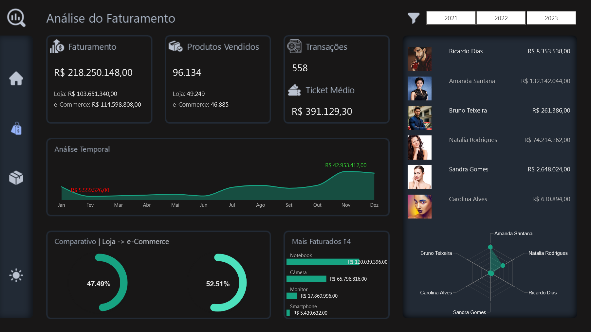

# 📊 Projeto Faturamento — ByteWave

## 📌 Visão Geral

Este projeto apresenta um **dashboard analítico de vendas desenvolvido em Power BI** para a empresa fictícia **ByteWave**, com foco na análise de faturamento, volume de produtos vendidos e desempenho comercial.

A solução foi construída para consolidar dados transacionais em uma **estrutura analítica clara**, permitindo identificar tendências de vendas, participação de canais comerciais e performance dos vendedores.

🔎 **Acesse o dashboard interativo:**  
- https://app.powerbi.com/view?r=eyJrIjoiNWI2NzFiYWQtNGZlMy00ZDVkLTgwOTgtODM1NDA1NzJlZjFmIiwidCI6IjIzY2FjN2VlLWYxZDgtNDMzOS1hYTdiLTc4MWFhOWY5MjI1YiJ9

🔎 [Dashboard Interativo](https://app.powerbi.com/view?r=eyJrIjoiNWI2NzFiYWQtNGZlMy00ZDVkLTgwOTgtODM1NDA1NzJlZjFmIiwidCI6IjIzY2FjN2VlLWYxZDgtNDMzOS1hYTdiLTc4MWFhOWY5MjI1YiJ9)  

---

# 🧠 Contexto do Problema

A ByteWave precisava compreender com maior clareza o desempenho de suas vendas em diferentes canais de comercialização.

Embora os dados transacionais existissem, faltava uma **visão analítica consolidada** capaz de apresentar:

- evolução do faturamento  
- volume de produtos vendidos  
- desempenho dos vendedores  
- participação dos canais de venda  

Essa ausência dificultava a identificação de **tendências de mercado e oportunidades de crescimento**.

---

# 🎯 Abordagem Estratégica

Para solucionar o problema foi desenvolvido um **dashboard analítico em Power BI**, estruturado com **modelagem dimensional** para organizar os dados de vendas, produtos, vendedores e canais comerciais.

O dashboard permite acompanhar métricas estratégicas como:

- **Faturamento Total**
- **Quantidade de Produtos Vendidos**
- **Quantidade de Transações**
- **Ticket Médio**

A solução proporciona uma **visão integrada do desempenho comercial**, facilitando análises comparativas e tomada de decisão baseada em dados.

---

# 📊 Estrutura do Dashboard

O projeto segue **padrão visual em Dark Mode** e possui uma **capa com menu lateral esquerdo** para navegação entre as páginas analíticas.

## Capa (Home)

Menu lateral com opções:

- Alternância entre **Dark Mode e Light Mode**
- **Home**
- **Análise do Faturamento**
- **Análise dos Produtos Vendidos**

Indicadores principais:

- Faturamento
- Quantidade de Produtos Vendidos
- Quantidade de Transações
- Quantidade de Vendedores
- Quantidade de Produtos no Catálogo

---

# 💰 Página: Análise do Faturamento

Indicadores principais:

- **Faturamento Total**
  - Faturamento Loja
  - Faturamento e-Commerce

- **Total de Produtos Vendidos**
  - Quantidade Loja
  - Quantidade e-Commerce

- Quantidade de Transações  
- Ticket Médio

Análises disponíveis:

- **Gráfico de área** com evolução do faturamento de **janeiro a dezembro**, com destaque para o **mês de maior e menor faturamento**
- **Gráficos de rosca** mostrando a participação percentual da **Loja Física e do e-Commerce**
- **Gráfico de barras horizontais** com os **Top 4 produtos mais faturados**
- **Tabela com foto, nome e faturamento dos vendedores**
- **Gráfico radar** comparando o desempenho de faturamento entre os vendedores

---

# 📦 Página: Análise dos Produtos Vendidos

Mantém a mesma estrutura analítica da página anterior, porém com foco no **volume de produtos comercializados**.

Indicadores:

- Quantidade de Produtos Vendidos
- Quantidade Loja
- Quantidade e-Commerce
- Quantidade de Transações
- Ticket Médio

Análises disponíveis:

- **Gráfico temporal** com evolução da quantidade de produtos vendidos ao longo do ano
- **Gráficos de rosca** com a participação da Loja Física e do e-Commerce no volume total
- **Gráfico de barras horizontais** mostrando a **quantidade de transações por vendedor**
- **Tabela detalhada** com:
  - Nome do Produto
  - Quantidade vendida na Loja
  - Quantidade vendida no e-Commerce

---

# 🛠️ Tecnologias Utilizadas

- **Power BI** — desenvolvimento das visualizações e narrativa analítica  
- **DAX** — criação de métricas como faturamento total, ticket médio e indicadores comparativos  
- **Linguagem M (Power Query)** — transformação e preparação dos dados  
- **Modelagem Dimensional** — estruturação das entidades de vendas, produtos, vendedores e canais  
- **Data Storytelling** — organização visual das análises para facilitar interpretação e tomada de decisão

---

# 📈 Conexão com Estratégia Comercial

O dashboard fortalece a capacidade analítica da ByteWave ao permitir:

- monitoramento do desempenho de vendas
- comparação entre canais de comercialização
- identificação de tendências de consumo
- análise do desempenho individual dos vendedores
- suporte à tomada de decisões comerciais e estratégicas

A solução contribui para uma gestão comercial **orientada por dados**, aumentando a capacidade de planejamento e crescimento do negócio.

---

# 📸 Preview do Dashboard

## Documentação das Medidas

Para consultar a documentação das medidas deste projeto, suas fórmulas e descrições, acesse a [Documentação das Medidas](docs/medidas-documentacao.md).

# 👨‍💻 Autor

Projeto desenvolvido como parte do meu portfólio profissional em **Business Intelligence e Data Analytics**, destacando habilidades avançadas e aplicáveis a diversos cenários analíticos:

- Desenvolvimento de **dashboards executivos e painéis estratégicos**, focados em insights acionáveis e tomada de decisão baseada em dados  
- **Modelagem dimensional e relacional**, aplicando corretamente **cardinalidade, granularidade** e hierarquias entre tabelas para garantir consistência e integridade dos dados  
- **Transformação de dados com Power Query e Linguagem M**, criando pipelines eficientes, automatizados e auditáveis  
- Criação de **KPIs estratégicos e métricas customizadas em DAX**, para análise de performance e comparações confiáveis  
- **Integração de múltiplas fontes de dados** (Excel, SQL, APIs, arquivos planos), padronizando e validando informações críticas  
- **Data storytelling e visualizações interativas**, com cores, hierarquias, filtros e destaque de insights, para facilitar interpretação e engajamento do usuário  
- **Análises estatísticas e preditivas**, usando Python, R, regressões, teste de hipóteses, séries temporais e técnicas de Machine Learning para identificação de tendências e padrões  
- **Automatização e otimização de processos analíticos**, incluindo ETL, scripts e compressão de dados, garantindo performance e escalabilidade dos relatórios  
- **Documentação detalhada de medidas, tabelas, modelos e processos**, permitindo reprodutibilidade, transparência e governança dos dados  
- Aplicação de **boas práticas de engenharia de dados**, integrando análise, estatística, IA e visualização para soluções analíticas completas e confiáveis  
- Domínio completo de **Power BI, DAX, Power Query, Python e R**, com foco em performance, qualidade e entrega de insights estratégicos

---

  
**Portfólio de Business Intelligence & Data Analytics**  

